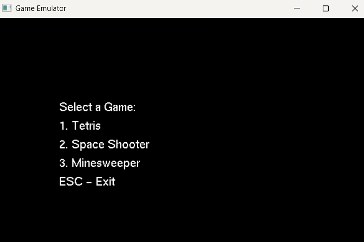
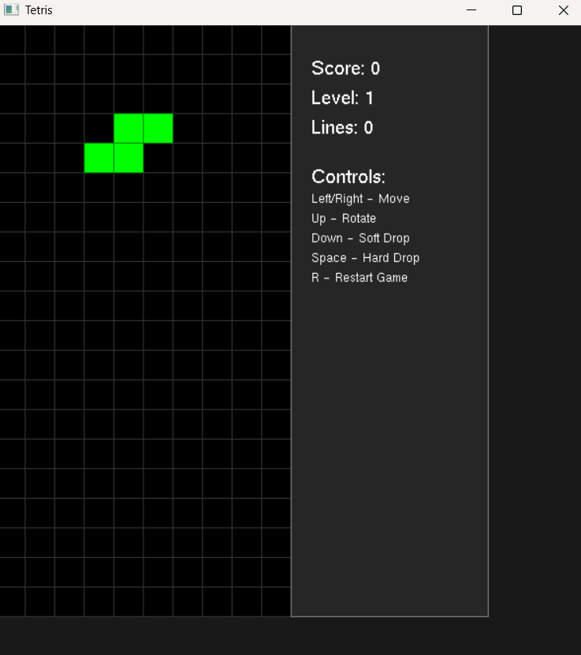
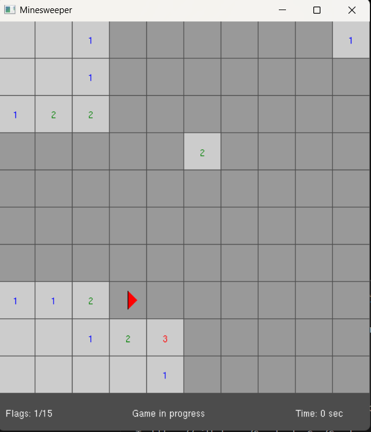
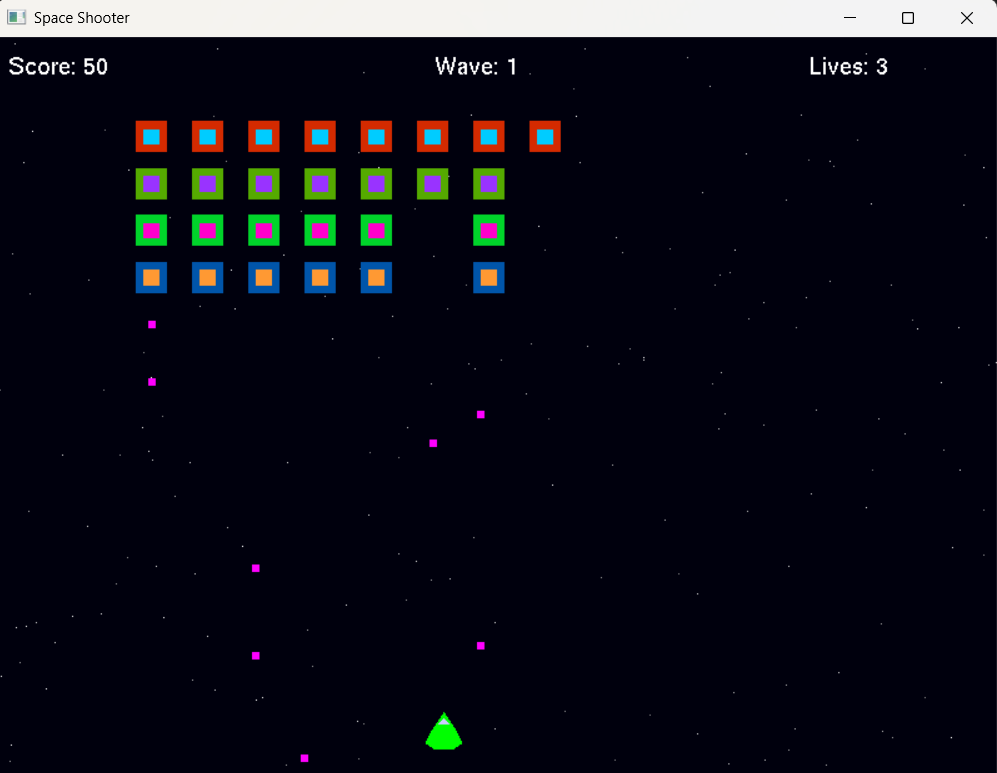

# 🎮 Gamebox

This project is a simple emulator-style game interface using OpenGL (GLUT) in C++. It allows launching three classic games from a menu:

- 🧱 Tetris
- 🚀 Space Shooter
- 💣 Minesweeper

## 💡 Features

- Clean UI to launch games from a central menu
- Each game opens in a separate GLUT window


## 🎮 Controls

### Tetris
- Arrow keys: Move
- Up Arrow: Rotate
- Down Arrow: Drop
- Space Bar: Hard Drop

### Space Shooter
- Arrow keys: Move
- Space: Shoot

### Minesweeper
- Left Click: Reveal
- Right Click: Flag

## 🛠 Requirements

- C++ compiler (GCC/MinGW or g++)
- OpenGL libraries (GLUT or FreeGLUT)
- Code::Blocks (for Windows) or command-line make

## 🔧 Build Instructions

### Code::Blocks

1. Create a new empty project.
2. Add all .cpp files to the project.
3. Go to Project → Build Options → Linker Settings, and add:-lglut32 -lglu32 -lopengl32

    ### Terminal (Linux/MinGW)

    ```bash
    g++ main.cpp game1_tetris.cpp game2_shooter.cpp game3_mines.cpp -o emulator -lglut -lGLU -lGL ./emulator


Emulator



Tetris



Minesweeper



Space Shooter



